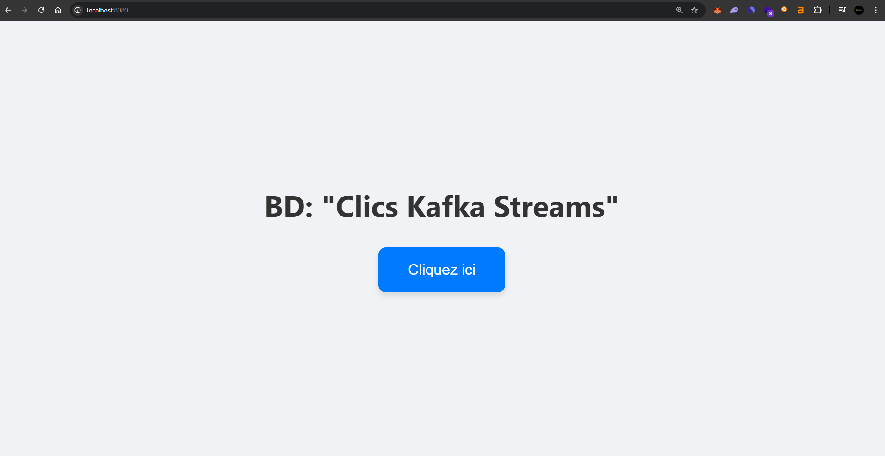
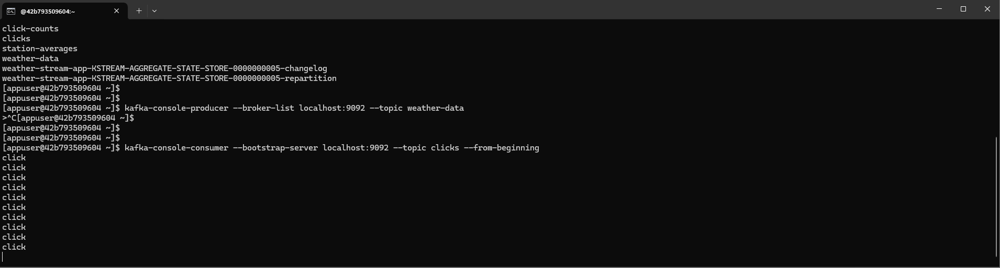
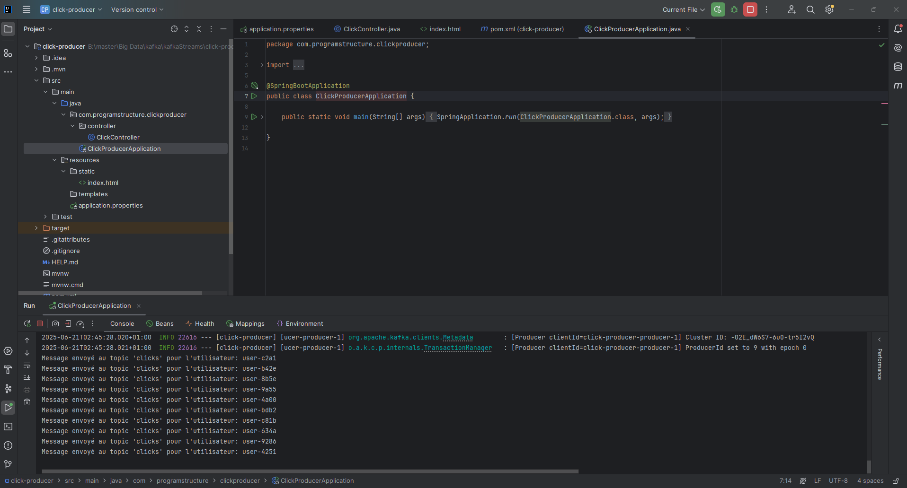
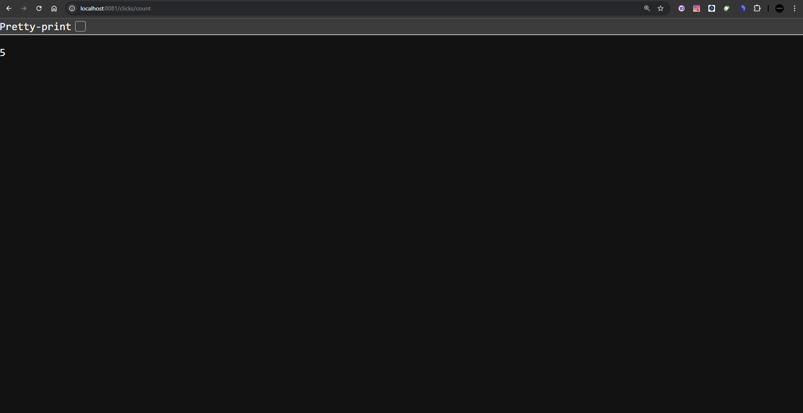
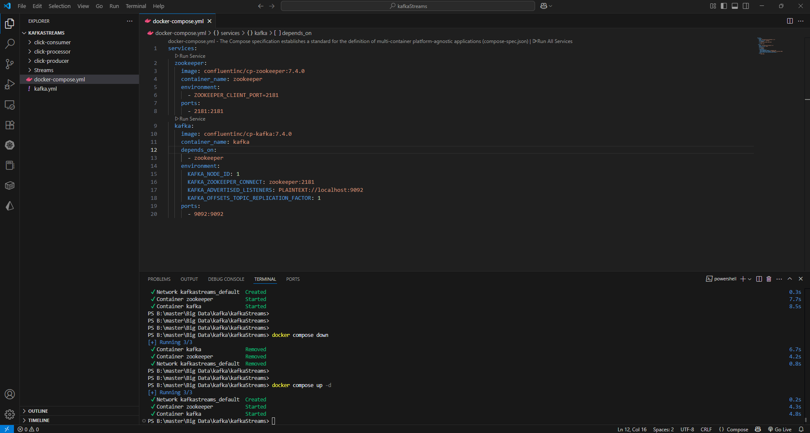

# TP 1 – Kafka Streams : Traitement de Données en Temps Réel

Ce dépôt contient deux exercices pratiques utilisant **Apache Kafka**, **Kafka Streams** et **Spring Boot**, dans le cadre du cours **Big Data Processing 2024** dispensé par **Mr. Abdelmajid BOUSSELHAM**.  
L’objectif est d’apprendre à traiter des données en temps réel dans une architecture orientée événements.

---

## 🌀 Exercice 1 : Analyse de Données Météorologiques

### 🎯 Objectif

Créer une application Kafka Streams pour analyser des données météorologiques collectées en temps réel depuis plusieurs stations.

### 🔄 Pipeline de traitement

1. **Lecture** des messages depuis le topic Kafka `weather-data`.  
   Format : `station,temperature,humidity`  
   Exemple : `Station2,35.0,50`

2. **Filtrage** : ne conserver que les relevés où la température est **supérieure à 30°C**.

3. **Conversion** des températures en Fahrenheit  
   Formule : `Fahrenheit = (Celsius * 9/5) + 32`

4. **Groupement par station** :
   - Calcul de la **température moyenne**
   - Calcul de l’**humidité moyenne**

5. **Écriture** des résultats dans un nouveau topic Kafka `station-averages`.

### 🧩 Concepts Kafka utilisés

- `KStream`, `KGroupedStream`, `KTable`
- Sérialisation/désérialisation des données
- Agrégation par clé (station)

---

## 🖱️ Exercice 2 : Suivi de Clics en Temps Réel avec Kafka Streams et Spring Boot

### 🎯 Objectif

Développer une solution complète pour **suivre les clics utilisateurs** en temps réel via une interface web, en intégrant Kafka Streams avec Spring Boot.

### 🧱 Architecture

- **Frontend Web (Producteur)** :
  - Une page avec un bouton "Cliquez ici"
  - Envoie un message Kafka avec une `clé = userId` et `valeur = "click"` vers le topic `clicks`

- **Kafka Streams (Traitement)** :
  - Lit les messages du topic `clicks`
  - Compte dynamiquement les clics (globaux ou par utilisateur)
  - Écrit les résultats dans le topic `click-counts`

- **API REST (Consommateur)** :
  - Application Spring Boot qui consomme `click-counts`
  - Expose un endpoint `GET /clicks/count`
  - Retourne le nombre total de clics en temps réel

### 🔧 Technologies

- Kafka + Kafka Streams
- Spring Boot (Web, Kafka)
- REST API
- JSON

---

## 📷 Résultas

