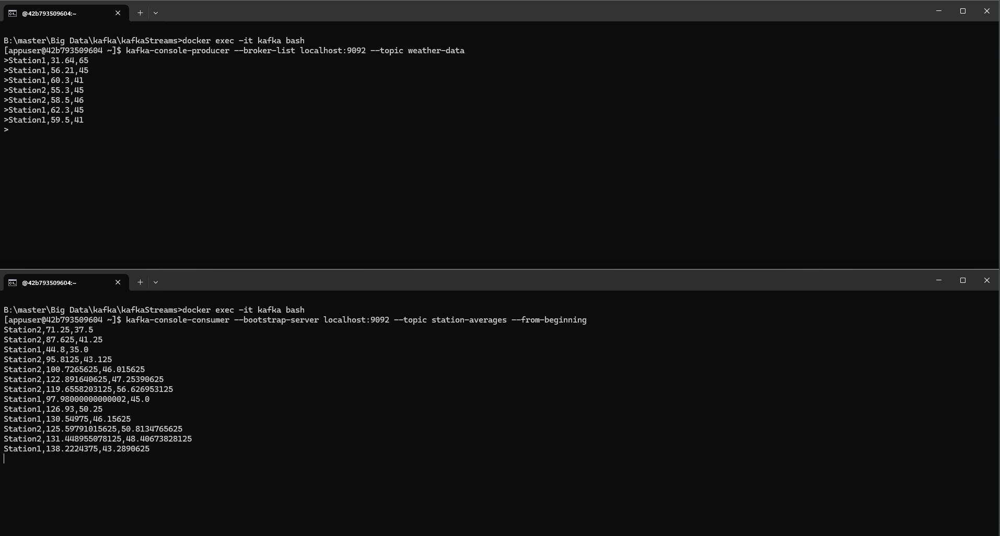
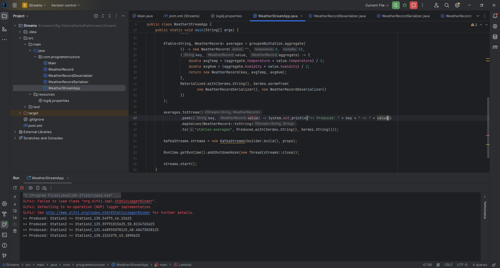

# KAFKA STREAMS

## Analyse de Données Météorologiques
Une entreprise collecte des données météorologiques en temps réel via Kafka. Chaque
station météorologique envoie des messages dans le topic Kafka nommé 'weather-data'. Les
messages ont le format suivant :

- station : L'identifiant de la station (par exemple, Station1, Station2, etc.).
- temperature : La température mesurée (en °C, par exemple, 25.3).
- humidity : Le pourcentage d'humidité (par exemple, 60).

### Les etapes suivi:
1 - Lire les données météorologiques : Lisez les messages depuis le topic Kafka 'weather-data' en utilisant un flux (KStream).
2 - Filtrer les données de température élevée:
- Ne conservez que les relevés où la température est supérieure à 30°C.
3 - Convertir les températures en Fahrenheit:
- Convertissez les températures mesurées en degrés Celsius (°C) en Fahrenheit (°F) avec la formule : Fahrenheit = (Celsius * 9/5) + 32
4 - Grouper les données par station:
- Regroupez les relevés par station (station).
- Calculez la température moyenne et le taux d'humidité moyen pour chaque station.
5 - Écrire les résultats:
- Publiez les résultats agrégés dans un nouveau topic Kafka nommé 'station-averages'.

### Contraintes
- Utilisez les concepts de KStream, KTable, et KGroupedStream.
- Gérer les données en assurant une sérialisation correcte.
- Assurez un arrêt propre de l'application en ajoutant un hook.
### Objectif
À la fin de l'exercice, votre application Kafka Streams doit :
- Lire les données météo depuis le topic 'weather-data'.
- Filtrer et transformer les relevés météorologiques.
- Publier les moyennes de température et d'humidité par station dans le topic 'station-averages'.

### Exemple de Résultat format images:

## Calcul du nombre de clics avec Kafka Streams et Spring Boot
Dans cet exercice, vous allez développer une solution complète basée sur Kafka Streams et Spring Boot pour suivre et analyser les clics des utilisateurs en temps réel. Le but est de concevoir une application web où les utilisateurs peuvent cliquer sur un bouton, et chaque clic sera enregistré et comptabilisé. Les données de clics seront traitées en temps réel à l'aide de Kafka Streams, et les résultats seront exposés via une API REST. Ce projet vise à familiarizer les étudiants avec le fonctionnement de Kafka, Kafka Streams, et leur intégration avec Spring Boot dans une architecture orientée événements.

### Producteur Web :
* Développez une application web Spring Boot qui expose une interface simple contenant un bouton "Cliquez ici".
* Chaque clic sur ce bouton doit envoyer un message à un cluster Kafka. Le message doit inclure une clé (par exemple, userId) pour identifier l'utilisateur et une valeur ("click") pour représenter l'action.
* Configurez le producteur pour publier ces messages dans un topic Kafka nommé clicks.

### Application Kafka Streams :
* Créez une application Kafka Streams qui consomme les messages du topic clicks.
* Implémentez un traitement pour compter dynamiquement le nombre total de clics (soit globalement, soit par utilisateur).
* Configurez l'application pour produire les résultats dans un autre topic Kafka nommé click-counts.

### Consommateur REST :
* Développez une autre application Spring Boot qui consomme les données du topic Kafka click-counts.
* Implémentez une API REST avec un endpoint (GET /clicks/count) qui retourne le nombre total de clics en temps réel.

### Exemple de Résultat format images:

